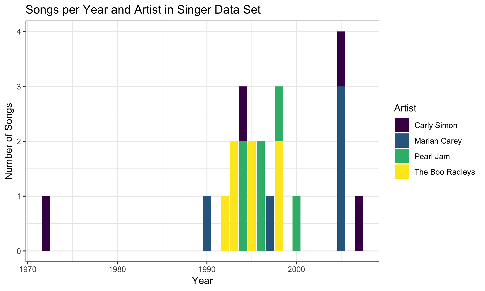

### Part 1: Factor management

##### 1. Drop factor / levels;

_Drop Oceania. Filter the Gapminder data to remove observations associated with the continent of Oceania. Additionally, remove unused factor levels. Provide concrete information on the data before and after removing these rows and Oceania; address the number of rows and the levels of the affected factors._

First, I will load the required packages:
```{r, message = FALSE, warning = FALSE}
library(tidyverse)
library(knitr)
library(gapminder)
library(viridisLite)
library(viridis)
library(plotly)
```


Let's have a look at the `gapminder` data set and the continent variable first. I will check what levels there are in the `continent` factor and how many rows the data set has. 

```{r}
levels(gapminder$continent)
nrow(gapminder)
```

Ok, the factor `continent` has 5 levels and the data set has 1704 rows. Let's see how many entries there are for each continent. I will also look at the number of countries to see if dropping Oceania leads to dropping of levels in other factors as well. If that is the case, the number of countries should be reduced by 2 (Australia and New Zealand) after dropping.

```{r}
fct_count(gapminder$continent) %>%
  kable(col.names = c("Continent", "Entries"))

nlevels(gapminder$country)
```
Oceania has 24 entries (multiple year entries for 2 countries) and the gapminder data set includes 142 countries in total. 

Ok, now let's see how that changes if we filter out Oceania:

```{r}
no_OC <- gapminder %>%
  filter(continent != "Oceania")

levels(no_OC$continent)
nrow(no_OC)
```

The levels are still the same after filtering, Oceania is still included, but the number of rows is reduced. Let's have a look again at the number of entries per continent and the number of countries:

```{r}
fct_count(no_OC$continent) %>%
  kable(col.names = c("Continent", "Entries"))

nlevels(no_OC$country)
```

Interesting! Ocenia is still there as a level but its entries are gone, which is in line with the reduced number of rows in the data set. The levels of the `country` factor are still the same though.

What happens if we plot it?

```{r}
no_OC %>%
  ggplot(aes(continent, lifeExp)) +
  geom_boxplot() +
  theme_bw() +
  labs(title = "Life Expectancy in different continents", x = "", y = "Life Expectancy (years)") +
  theme(
    axis.text = element_text(
      size = 12
    ),
    axis.title = element_text(
      size = 13
    ),
    legend.text = element_text(
      size = 12
    )
  )
```

Oceania doesn't show up in the figure. So in conclusion, filtering removes the Oceania data, but the level is kept (as well as levels in other factors). The filtered out level doesn't show up in a plot.
 
Let's drop the level and see what happens:

```{r}
real_no_OC <- no_OC %>%
  droplevels()

levels(real_no_OC$continent)
nrow(real_no_OC)

fct_count(real_no_OC$continent) %>%
  kable(col.names = c("Continent", "Entries"))
nlevels(real_no_OC$country)
```

Oceania is gone as a level and the number of levels of `country` is reduced as well! This means `droplevels` drops levels from multiple factors, not just the one that we filtered.

We can also use `fct_drop` to drop specifically only the levels from `continent` and leave the rest intact:
```{r}
other_no_OC <- no_OC %>%
  mutate(continent = fct_drop(continent))

nrow(other_no_OC)
levels(other_no_OC$continent)

fct_count(other_no_OC$continent) %>%
  kable(col.names = c("Continent", "Entries"))

nlevels(other_no_OC$country)
```

In this case, the number of countries is still 142, so the levels of the `country` factor remain the same, while the all Oceania data as well as Oceania as a level of the continent factor is gone. Can we still make use of the Oceania countries?

```{r}
other_no_OC %>%
  filter(country == "Australia") %>%
  summarize(mean = mean(lifeExp)) %>%
  kable()
```

No, the level "Australia" is still available in the `country` factor but we cannot use it. Which makes sense because the rows are gone, too. So `droplevels` is more useful in removing unused factor levels than `fct_drop`.


#### 2. Reorder levels based on knowledge from data.

_Reorder the levels of country or continent. Use the forcats package to change the order of the factor levels, based on a principled summary of one of the quantitative variables._

Let's calculate the mean of `lifeExp` for each continent and plot it to see how it's ordered originally.
```{r}
mean_lifeExp_continent <- gapminder %>%
  group_by(continent) %>%
  summarize(mean = mean(lifeExp))

kable(mean_lifeExp_continent)

# write function for plotting this
mean_lifeExp_plot <- function(lifeExp_data) {
  ggplot(lifeExp_data, aes(continent, mean)) +
    geom_bar(
      stat = "identity",
      width = 0.5,
      fill = "grey80",
      colour = "grey40"
    ) +
    labs(
      title = "Mean Life Expectancy in Different Continents",
      x = "",
      y = "Mean Life Expectancy (years)"
    ) +
    theme_bw() +
    theme(
      axis.text = element_text(
        colour = "grey40",
        size = 12
      ),
      axis.title.y = element_text(
        size = 13,
        colour = "grey40"
      )
    )
}

mean_lifeExp_plot(mean_lifeExp_continent)
```

Looks like it's ordered by alphabet. Let's arrange the data by `median lifeExp` by using the `arrange` function.

```{r}
mean_lifeExp_arr <- mean_lifeExp_continent %>%
  arrange(mean)

kable(mean_lifeExp_arr)
```

Arranging worked, let's see how it looks when we plot it:

```{r}
mean_lifeExp_arr %>%
  mean_lifeExp_plot()
```

The continents are still ordered by alphabet, so using `arrange` doesn't have an effect on making a figure. We need to use `fct_reorder` from the `forcats` package (included in `tidyverse`):

```{r}
mean_lifeExp_reord <- mean_lifeExp_continent %>%
  mutate(continent = fct_reorder(continent, mean))

kable(mean_lifeExp_reord)
```

Interestingly, the data itself is not order when presented as a table. Are the levels ordered?

```{r}
levels(mean_lifeExp_reord$continent)
```

Yes, the levels are differently ordered now. Let's plot it and see if they are ordered correctly by life expectancy:

```{r}
mean_lifeExp_reord %>%
  mean_lifeExp_plot()
```

Yes, the continents are nicely ordered by median life expectancy.

Let's try to use `fct_reorder` and `arrange` together. In the previous graph the data is ordered in ascending order. Let's see if using `arrange` to sort it in descending order before applying `fct_reorder` can change the previous figure.

```{r}
mean_lifeExp_continent %>%
  arrange(desc(mean)) %>%
  mutate(continent = fct_reorder(continent, mean)) %>%
  mean_lifeExp_plot()
```

No, the `arrange` function cannot influence the order that appears in the graph. We can do that with `fct_reorder` though:

```{r}
mean_lifeExp_continent %>%
  mutate(continent = fct_reorder(continent, mean, desc)) %>%
  mean_lifeExp_plot()
```

Cool, arranged in descending order!

### Part 2: File I/O

_Experiment with one or more of write_csv()/read_csv() (and/or TSV friends), saveRDS()/readRDS(), dput()/dget(). Create something new, probably by filtering or grouped-summarization of Singer or Gapminder. I highly recommend you fiddle with the factor levels, i.e. make them non-alphabetical (see previous section). Explore whether this survives the round trip of writing to file then reading back in._

Let's use the data from Europe and reorder the countries by median life expectancy:
```{r}
med_lifeExp_EU <- gapminder %>%
  filter(continent == "Europe") %>%
  group_by(country) %>%
  summarize(mean = mean(lifeExp)) %>%
  mutate(country = fct_reorder(country, mean))

kable(head(med_lifeExp_EU))
```

As shown above, the `fct_reorder` isn't obvious when presented in a table, it's the levels that are reordered. Let's plot this to see if they're properly arranged.

```{r}
# write function for plotting EU lifeExp data
plot_EU <- function(EU_data) {
  ggplot(EU_data, aes(country, mean)) +
    geom_point(colour = "hotpink") +
    labs(
      title = "Median Life Expectancy in Europe",
      x = "",
      y = "Median Life Expectancy (years)"
    ) +
    theme_bw() +
    theme(axis.text = element_text(
      angle = 90,
      hjust = 1
    ))
}

plot_EU(med_lifeExp_EU)
```

Looks perfectly ordered! Now I will write it to a .csv and see if the order is still the same when reading it back in.

```{r, message =FALSE}
write_csv(med_lifeExp_EU, "HW05-Factor_and_figure_management_files/med_lifeExp_EU.csv")

med_lifeExp_EU_read <- read_csv("HW05-Factor_and_figure_management_files/med_lifeExp_EU.csv")
```

Let's plot the new file to see if the countries are still ordered by median life expectancy:

```{r}
plot_EU(med_lifeExp_EU_read)
```

No they are not! `read_csv` must automatically sort the levels of factors by alphabet.


### Part 3: Visualization design

#### 1. Make a graph better in ggplot
_Remake at least one figure or create a new one, in light of something you learned in the recent class meetings about visualization design and color. Maybe juxtapose your first attempt and what you obtained after some time spent working on it. Reflect on the differences. If using Gapminder, you can use the country or continent color scheme that ships with Gapminder. Consult the dimensions listed in All the Graph Things._

I will use the singer data set to switch it up a little bit. I'll have to load the data first:

```{r}
library(singer)
```

From Joey Bernhardt's singer repo I know that the data set is called `songs`. Let's have a look at it:

```{r}
kable(head(songs))

nlevels(factor(songs$artist_name))
levels(factor(songs$artist_name))
nlevels(factor(songs$year))
```

Cool, the `songs` data set has 3 variables: song title, artist name and year. There are only 4 different artists and songs from 12 different years. Let's make a graph of the number of songs in the data set per year:

```{r, warning=FALSE}
songs %>%
  ggplot(aes(year, fill = artist_name)) +
  geom_bar()
```

This is the basic ggplot graph. It gives an overview of the songs included from each year, coloured by artist. It is not very easy to read and also kind of ugly. Maybe it makes more sense to calculate the number of songs per artist per year and make a graph of that.

```{r}
songs_artist_year <- songs %>%
  group_by(artist_name, year) %>%
  summarize(n_songs = n())

songs_artist_year %>%
  ggplot(aes(year, n_songs, fill = artist_name)) +
  geom_bar(stat = "identity")
```

This looks better, now we can get an idea of the total number of songs from each year and which artist they were by. Let's change some things to make it prettier, colour-blind friendly and more self-explanatory. I will use `theme_bw` and the `viridis` colour palette as was shown in class. I will also change the font size of the axis labels and text.

```{r}
(song_plot <- songs_artist_year %>%
  ggplot(aes(year, n_songs, fill = artist_name)) +
  geom_bar(stat = "identity") +
  scale_fill_viridis_d() +
  labs(
    title = "Songs per Year and Artist in Singer Data Set",
    x = "Year",
    y = "Number of Songs",
    fill = "Artist"
  ) +
  theme_bw()) +
  theme(
    axis.text = element_text(
      size = 11
    ),
    axis.title = element_text(
      size = 12
    ),
    legend.text = element_text(
      size = 11
    ),
    legend.title = element_text(
      size = 12
    ),
    plot.title = element_text(
      face = "bold"
    )
  )
```

This new plot is more colour-blind friendly, the labels are easy to understand and the title gives an overview.

#### 2. Make a plotly graph
_Then, make a new graph by converting this visual (or another, if you’d like) to a plotly graph. What are some things that plotly makes possible, that are not possible with a regular ggplot2 graph? _

I can easily turn the previous plot into a plotly with the code `ggplotly(song_plot)`. However, I will make a graph from scratch so that you can run this code chunk independently in your console to see the graph, as it won't display on github. I will plot the life expectancy in several countries in Asia throughout the years.

```{r, message = FALSE}
# packages needed to run this chunk
library(tidyverse)
library(knitr)
library(gapminder)
library(viridisLite)
library(viridis)
library(plotly)

countries_asia <- c("Nepal", "India", "Singapore", "Sri Lanka", "Thailand", "Indonesia")

gap_Asia <- gapminder %>%
  filter(country %in% countries_asia) %>%
  mutate(country = fct_reorder2(country, year, lifeExp)) %>%
  ggplot(aes(year, lifeExp, colour = country)) +
  geom_line(lwd = 1) +
  labs(
    title = "Life Expectancy Change over Time in Countries in Asia",
    x = "Year",
    y = "Life Expectancy (years)",
    colour = ""
  ) +
  scale_colour_viridis_d() +
  theme_bw()

gap_Asia # present ggplot as a reference plot and to have some graph on github
# ggplotly(gap_Asia) # un-hash if you want to run the plotly in your console
```

Compared to ggplot, one can get the exact life expectancy for specific years when hovering over the lines in the plotly graph. We can even compare the different values from the countries at specific time points by selecting the "compare data on hover" option. We can also zoom in if there is a specific part of the graph that we want to have a closer look at. With these functions plotly is more interactive than ggplot.


#### Part 4: Writing figures to file

_Use ggsave() to explicitly save a plot to file. Then use `` to load and embed it in your report._ 

I will save the song graph as a png file. As this changes the dimensions, I will adjust them so that it still looks nice when I print it in the md file.

```{r}
ggsave("HW05-Factor_and_figure_management_files/song_plot.png", song_plot, height = 3, width = 5, scale = 1.5)
```

Here is the previously saved plot embeded in the text:  

