HW05-factor and figure management
================
Frederike Basedow
15 Oktober 2018

Load packages

``` r
library(tidyverse)
library(knitr)
library(gapminder)
library(viridisLite)
library(viridis)
library(plotly)
```

Goals:

-   Reorder a factor in a principled way based on the data and demonstrate the effect in arranged data and in figures.
-   Write some data to file and load it back into R.
-   Improve a figure (or make one from scratch), using new knowledge, e.g., control the color scheme, use factor levels, smoother mechanics.
-   Make a plotly visual.
-   Implement visualization design principles.

### The Assignment

#### Part 1: Factor management

With the data set of your choice, after ensuring the variable(s) you’re exploring are indeed factors, you are expected to:

1.  Drop factor / levels;
2.  Reorder levels based on knowledge from data.

We’ve elaborated on these steps for the gapminder and singer data sets below.

Be sure to also characterize the (derived) data before and after your factor re-leveling:

-   Explore the effects of arrange(). Does merely arranging the data have any effect on, say, a figure?
-   Explore the effects of reordering a factor and factor reordering coupled with arrange(). Especially, what effect does this have on a figure?

These explorations should involve the data, the factor levels, and some figures.

**Elaboration for the gapminder data set**

*Drop Oceania. Filter the Gapminder data to remove observations associated with the continent of Oceania. Additionally, remove unused factor levels. Provide concrete information on the data before and after removing these rows and Oceania; address the number of rows and the levels of the affected factors.*

Let's have a look at the gapminder data set and the continent variable first. I will check what levels there are in the continent variable and how the structure of the full data set looks like, including the number of rows.

``` r
levels(gapminder$continent)
```

    ## [1] "Africa"   "Americas" "Asia"     "Europe"   "Oceania"

``` r
nrow(gapminder)
```

    ## [1] 1704

``` r
str(gapminder)
```

    ## Classes 'tbl_df', 'tbl' and 'data.frame':    1704 obs. of  6 variables:
    ##  $ country  : Factor w/ 142 levels "Afghanistan",..: 1 1 1 1 1 1 1 1 1 1 ...
    ##  $ continent: Factor w/ 5 levels "Africa","Americas",..: 3 3 3 3 3 3 3 3 3 3 ...
    ##  $ year     : int  1952 1957 1962 1967 1972 1977 1982 1987 1992 1997 ...
    ##  $ lifeExp  : num  28.8 30.3 32 34 36.1 ...
    ##  $ pop      : int  8425333 9240934 10267083 11537966 13079460 14880372 12881816 13867957 16317921 22227415 ...
    ##  $ gdpPercap: num  779 821 853 836 740 ...

``` r
fct_count(gapminder$continent) %>% 
  kable(col.names = c("Continent", "Entries"))
```

| Continent |  Entries|
|:----------|--------:|
| Africa    |      624|
| Americas  |      300|
| Asia      |      396|
| Europe    |      360|
| Oceania   |       24|

Ok, now let's see how that changes if we filter out Oceania:

``` r
no_OC <- gapminder %>% 
  filter(continent != "Oceania")

levels(no_OC$continent)
```

    ## [1] "Africa"   "Americas" "Asia"     "Europe"   "Oceania"

``` r
nrow(no_OC)
```

    ## [1] 1680

``` r
str(no_OC)
```

    ## Classes 'tbl_df', 'tbl' and 'data.frame':    1680 obs. of  6 variables:
    ##  $ country  : Factor w/ 142 levels "Afghanistan",..: 1 1 1 1 1 1 1 1 1 1 ...
    ##  $ continent: Factor w/ 5 levels "Africa","Americas",..: 3 3 3 3 3 3 3 3 3 3 ...
    ##  $ year     : int  1952 1957 1962 1967 1972 1977 1982 1987 1992 1997 ...
    ##  $ lifeExp  : num  28.8 30.3 32 34 36.1 ...
    ##  $ pop      : int  8425333 9240934 10267083 11537966 13079460 14880372 12881816 13867957 16317921 22227415 ...
    ##  $ gdpPercap: num  779 821 853 836 740 ...

``` r
fct_count(no_OC$continent) %>% 
  kable(col.names = c("Continent", "Entries"))
```

| Continent |  Entries|
|:----------|--------:|
| Africa    |      624|
| Americas  |      300|
| Asia      |      396|
| Europe    |      360|
| Oceania   |        0|

``` r
no_OC %>% 
  ggplot(aes(continent, lifeExp)) +
  geom_boxplot() +
  theme_bw() +
  labs(title = "Life Expectancy in different continents", x = "Continent", y = "Life Expectancy") 
```

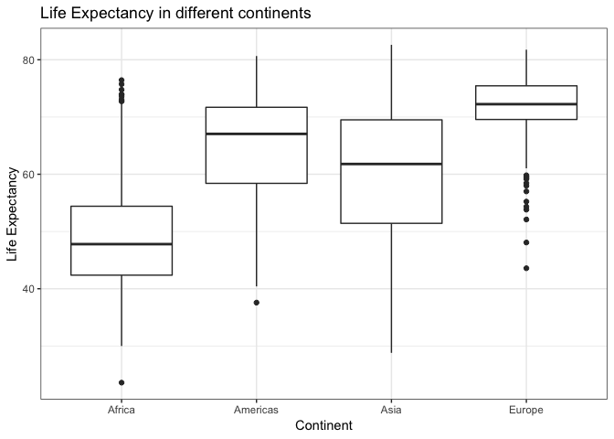

Just filtering gapminder to remove Oceania, doesn't actually remove it. There are still the same number of countries. However, there are less rows in the data set and when you plot it Oceania is not shown. Let's drop the level and see what happens:

``` r
real_no_OC <- no_OC %>% droplevels()

fct_count(real_no_OC$continent) %>% 
  kable(col.names = c("Continent", "Entries"))
```

| Continent |  Entries|
|:----------|--------:|
| Africa    |      624|
| Americas  |      300|
| Asia      |      396|
| Europe    |      360|

``` r
levels(real_no_OC$continent)
```

    ## [1] "Africa"   "Americas" "Asia"     "Europe"

``` r
nrow(real_no_OC)
```

    ## [1] 1680

``` r
str(real_no_OC)
```

    ## Classes 'tbl_df', 'tbl' and 'data.frame':    1680 obs. of  6 variables:
    ##  $ country  : Factor w/ 140 levels "Afghanistan",..: 1 1 1 1 1 1 1 1 1 1 ...
    ##  $ continent: Factor w/ 4 levels "Africa","Americas",..: 3 3 3 3 3 3 3 3 3 3 ...
    ##  $ year     : int  1952 1957 1962 1967 1972 1977 1982 1987 1992 1997 ...
    ##  $ lifeExp  : num  28.8 30.3 32 34 36.1 ...
    ##  $ pop      : int  8425333 9240934 10267083 11537966 13079460 14880372 12881816 13867957 16317921 22227415 ...
    ##  $ gdpPercap: num  779 821 853 836 740 ...

Oceania is gone as a level and the number of levels of `country` is reduced as well.

We can also use `fct_drop` to drop specifically only the levels from continent, but leave the rest intact:

``` r
other_no_OC <- no_OC %>% 
  mutate(continent = fct_drop(continent))

str(other_no_OC)
```

    ## Classes 'tbl_df', 'tbl' and 'data.frame':    1680 obs. of  6 variables:
    ##  $ country  : Factor w/ 142 levels "Afghanistan",..: 1 1 1 1 1 1 1 1 1 1 ...
    ##  $ continent: Factor w/ 4 levels "Africa","Americas",..: 3 3 3 3 3 3 3 3 3 3 ...
    ##  $ year     : int  1952 1957 1962 1967 1972 1977 1982 1987 1992 1997 ...
    ##  $ lifeExp  : num  28.8 30.3 32 34 36.1 ...
    ##  $ pop      : int  8425333 9240934 10267083 11537966 13079460 14880372 12881816 13867957 16317921 22227415 ...
    ##  $ gdpPercap: num  779 821 853 836 740 ...

``` r
nrow(other_no_OC)
```

    ## [1] 1680

``` r
levels(other_no_OC$continent)
```

    ## [1] "Africa"   "Americas" "Asia"     "Europe"

``` r
fct_count(other_no_OC$continent) %>% 
  kable(col.names = c("Continent", "Entries"))
```

| Continent |  Entries|
|:----------|--------:|
| Africa    |      624|
| Americas  |      300|
| Asia      |      396|
| Europe    |      360|

``` r
other_no_OC %>% 
  filter(country == "Australia") %>% 
  nrow() # see if we can still make use of the Oceania countries
```

    ## [1] 0

Now all levels in the country factor are kept while Oceania is removed as a level from the factor continent. However, they are not used, as we can see when we filter for Australia, which gives us zero rows as an output. So `droplevels` is more useful in removing unused factor levels.

**Reorder the levels of country or continent.* Use the forcats package to change the order of the factor levels, based on a principled summary of one of the quantitative variables. Consider experimenting with a summary statistic beyond the most basic choice of the median.*

Let's calculate and plot the mean of lifeExp for each continent and plot it to see how it's automatically ordered.

``` r
mean_lifeExp_continent <- gapminder %>% 
  group_by(continent) %>% 
  summarize(mean = mean(lifeExp))

kable(mean_lifeExp_continent)
```

| continent |      mean|
|:----------|---------:|
| Africa    |  48.86533|
| Americas  |  64.65874|
| Asia      |  60.06490|
| Europe    |  71.90369|
| Oceania   |  74.32621|

``` r
# write function for plotting this
mean_lifeExp_plot <- function(lifeExp_data) {
  ggplot(lifeExp_data, aes(continent, mean)) +
  geom_bar(stat = "identity", width = 0.5, fill = "grey80", colour = "grey40") +
  labs(title = "Mean Life Expectancy in Different Continents", x = "", y = "Mean Life Expectancy (years)") +
  theme_bw() + 
  theme(
    axis.text = element_text(
      colour = "grey40",
      size = 12
    ),
    axis.title.y = element_text(
      size = 13
    ))
}

mean_lifeExp_plot(mean_lifeExp_continent)
```

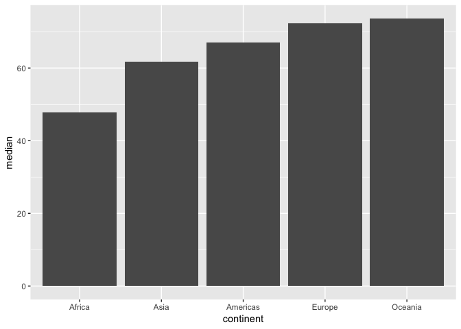

Looks like it's ordered by alphabet. Let's arrange the data by median lifeExp instead using the `arrange` function.

``` r
mean_lifeExp_arr <- mean_lifeExp_continent %>% 
  arrange(mean)

kable(mean_lifeExp_arr)
```

| continent |      mean|
|:----------|---------:|
| Africa    |  48.86533|
| Asia      |  60.06490|
| Americas  |  64.65874|
| Europe    |  71.90369|
| Oceania   |  74.32621|

Arranging worked, let's see how it looks when we plot it:

``` r
mean_lifeExp_arr %>% 
  mean_lifeExp_plot()
```

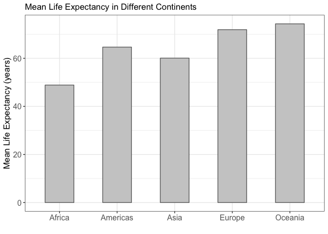

The continents are still ordered by alphabet, so using `arrange` doesn't have an effect on making a figure. We need to use `fct_reorder` from the `forcats` package (included in `tidyverse`):

``` r
mean_lifeExp_reord <- mean_lifeExp_continent %>% 
  mutate(continent = fct_reorder(continent, mean)) 

kable(mean_lifeExp_reord)
```

| continent |      mean|
|:----------|---------:|
| Africa    |  48.86533|
| Americas  |  64.65874|
| Asia      |  60.06490|
| Europe    |  71.90369|
| Oceania   |  74.32621|

Interestingly, the data itself is not order when presented as a table. Are the levels ordered?

``` r
levels(mean_lifeExp_reord$continent)
```

    ## [1] "Africa"   "Asia"     "Americas" "Europe"   "Oceania"

Yes, the levels are differently ordered now. Let's plot it and see if it's ordered correctly by life expectancy:

``` r
mean_lifeExp_reord %>% 
  mean_lifeExp_plot()
```

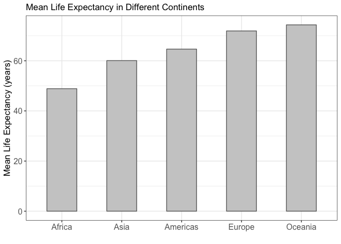

Yes, the continents are nicely ordered by median life expectancy.

Let's try to use `fct_reorder` and `arrange` together. In the previous graph the data is ordered in ascending order. Let's see if we can using arrange before to sort it in descending order can change the previous figure.

``` r
mean_lifeExp_continent %>% 
  arrange(desc(mean)) %>% 
  mutate(continent = fct_reorder(continent, mean)) %>% 
  mean_lifeExp_plot()
```

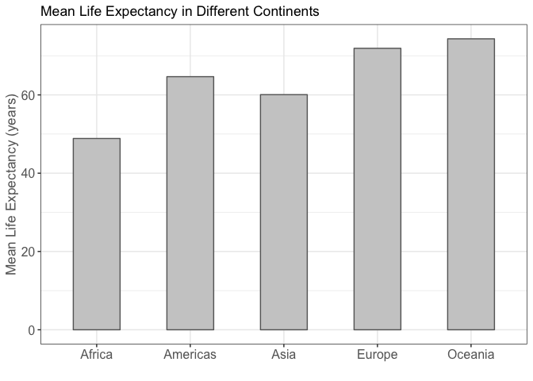

No, arrange cannot influence the order that appears in the graph.

#### Part 2: File I/O

*Experiment with one or more of write\_csv()/read\_csv() (and/or TSV friends), saveRDS()/readRDS(), dput()/dget(). Create something new, probably by filtering or grouped-summarization of Singer or Gapminder. I highly recommend you fiddle with the factor levels, i.e. make them non-alphabetical (see previous section). Explore whether this survives the round trip of writing to file then reading back in.*

Let's use the data from Europe and reorder the countries it by median life expectancy:

``` r
med_lifeExp_EU <- gapminder %>% 
  filter(continent == "Europe") %>% 
  group_by(country) %>% 
  summarize(mean = mean(lifeExp)) %>% 
  mutate(country = fct_reorder(country, mean)) 

kable(head(med_lifeExp_EU))
```

| country                |      mean|
|:-----------------------|---------:|
| Albania                |  68.43292|
| Austria                |  73.10325|
| Belgium                |  73.64175|
| Bosnia and Herzegovina |  67.70783|
| Bulgaria               |  69.74375|
| Croatia                |  70.05592|

Let's plot this to see if they're properly ordered

``` r
# write function for plotting EU lifeExp data
plot_EU <- function(EU_data) {
  ggplot(EU_data, aes(country, mean)) +
  geom_point(colour = "hotpink") +
  labs(title = "Median Life Expectancy in Europe", 
       x = "", 
       y = "Median Life Expectancy (years)") +
  theme_bw() +
  theme(axis.text = element_text(
    angle=90, 
    hjust = 1)
    )
}

plot_EU(med_lifeExp_EU)
```

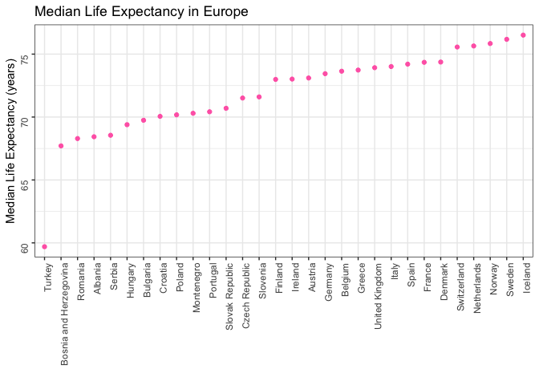

Looks perfectly ordered! Now I will write it to a .csv and see if the order is still the same when reading it back in.

``` r
write_csv(med_lifeExp_EU, "HW05-Factor_and_figure_management_files/med_lifeExp_EU.csv")

med_lifeExp_EU_read <- read_csv("HW05-Factor_and_figure_management_files/med_lifeExp_EU.csv")
```

Let's plot the new file to see if the countries are still ordered by median life expectancy:

``` r
plot_EU(med_lifeExp_EU_read)
```

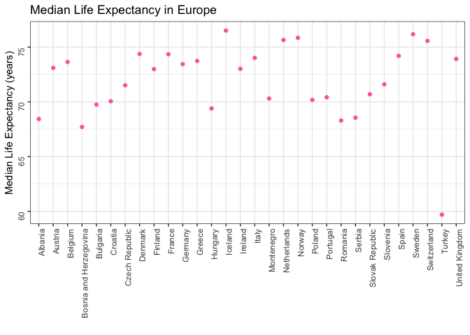

No they are not! `read_csv` must automatically sort the levels of factors by alphabet.

#### Part 3: Visualization design

*Remake at least one figure or create a new one, in light of something you learned in the recent class meetings about visualization design and color. Maybe juxtapose your first attempt and what you obtained after some time spent working on it. Reflect on the differences. If using Gapminder, you can use the country or continent color scheme that ships with Gapminder. Consult the dimensions listed in All the Graph Things.*

I will use the singer data set for this because it feels like I've made every possible graph in gapminder throughout this course. I'll have to load it first:

``` r
library(singer)
```

Let's have a look at it:

``` r
str(songs)
```

    ## Classes 'tbl_df', 'tbl' and 'data.frame':    22 obs. of  3 variables:
    ##  $ title      : chr  "Corduroy" "Grievance" "Stupidmop" "Present Tense" ...
    ##  $ artist_name: chr  "Pearl Jam" "Pearl Jam" "Pearl Jam" "Pearl Jam" ...
    ##  $ year       : int  1994 2000 1994 1996 1998 1996 1995 1992 1995 1993 ...

``` r
head(songs)
```

    ## # A tibble: 6 x 3
    ##   title         artist_name  year
    ##   <chr>         <chr>       <int>
    ## 1 Corduroy      Pearl Jam    1994
    ## 2 Grievance     Pearl Jam    2000
    ## 3 Stupidmop     Pearl Jam    1994
    ## 4 Present Tense Pearl Jam    1996
    ## 5 MFC           Pearl Jam    1998
    ## 6 Lukin         Pearl Jam    1996

``` r
nlevels(factor(songs$artist_name))
```

    ## [1] 4

``` r
levels(factor(songs$artist_name))
```

    ## [1] "Carly Simon"     "Mariah Carey"    "Pearl Jam"       "The Boo Radleys"

``` r
nlevels(factor(songs$year))
```

    ## [1] 12

Cool, the songs data set has 3 variables: song title, artist name and year. There are only 4 different artists and songs from 12 different years. Let's make a graph of the number of songs in the data set per year:

``` r
songs %>% 
  ggplot(aes(year, fill = artist_name)) +
  geom_bar()
```

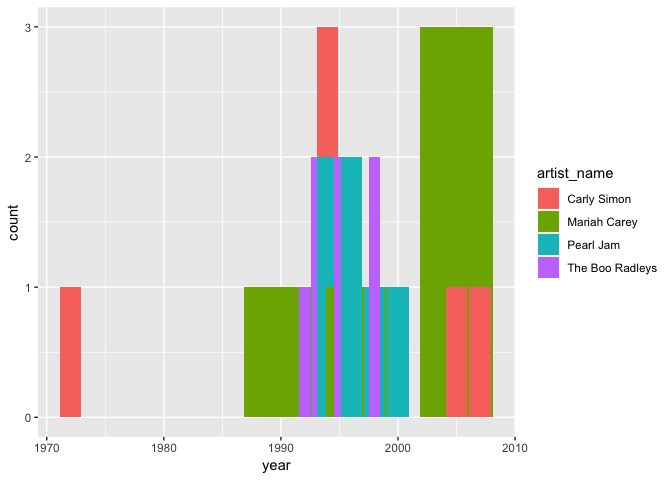

This is the basic ggplot graph. It gives an overview of the songs included from each year, coloured by artist. It is not very pretty though and also not very easy to draw conclusions from it. Maybe it makes more sense to calculate the number of songs per artist per year and make a graph of that.

``` r
songs_artist_year <- songs %>% 
  group_by(artist_name, year) %>% 
  summarize(n_songs=n()) 

songs_artist_year %>% 
  ggplot(aes(year, n_songs, fill = artist_name)) +
  geom_bar(stat = "identity")
```

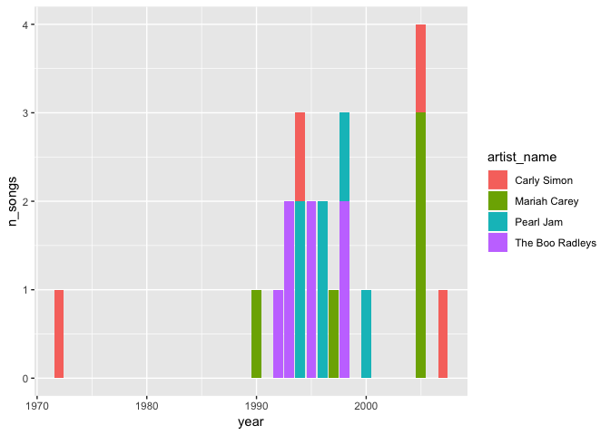

This looks better, now we can get an idea of the total number of songs from each year and which artist they were by. Let's change some things to make it prettier, colour-blind friendly and more self-explanatory.

``` r
(song_plot <- songs_artist_year %>% 
  ggplot(aes(year, n_songs, fill = artist_name)) +
  geom_bar(stat = "identity") +
  scale_fill_viridis_d() +
  labs(title = "Songs by Artists per Year in Singer Data Set", x = "Year", y = "Number of Songs", fill = "Artist") +
  theme_bw())
```

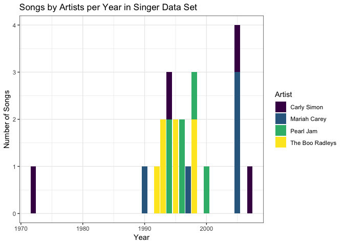

This new plot is more colour-blind friendly, the labels are easy to understand and the title gives an overview.

*Then, make a new graph by converting this visual (or another, if you’d like) to a plotly graph. What are some things that plotly makes possible, that are not possible with a regular ggplot2 graph? *

Here is the song plot as a plotly graph:

``` r
# ggplotly(song_plot)
```

In this plotly graph it is possible to check how many songs there are actually for each artist by hovering over the bars. While this is also fairly clear in the non-plotly graph, there is the option that the bars on top of others are actually behind the lower bars instead of on top. For example, there is one Carly Simon song in year 1994, but it could be interpreted that there are three if the bar was hidden between the two Pearl Jam songs. However, with this plotly graph we know for sure. While not that important in this graph with little data presented, in other graphs it may also be advantageous that you can zoom in and have a detailed look at a specific subset of data.

#### Part 4: Writing figures to file

Use ggsave() to explicitly save a plot to file. Then use `` to load and embed it in your report. You can play around with various options, such as:

-   Arguments of ggsave(), such as width, height, resolution or text scaling.
-   Various graphics devices, e.g. a vector vs. raster format.
-   Explicit provision of the plot object p via ggsave(..., plot = p). Show a situation in which this actually matters.

I will save the song graph as a png file. As this changes the dimensions, I will adjust them so that it still looks nice when I print it in the md file.

``` r
ggsave("HW05-Factor_and_figure_management_files/song_plot.png", song_plot, height = 3, width = 5, scale = 1.5)
```

Here is the previously saved plot embeded in the text: 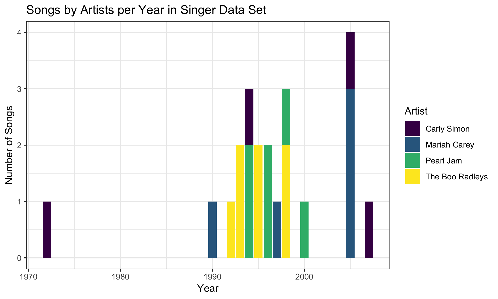

#### But I want to do more!

If you’re particularly keen on levelling up the challenge of this assignment, try these things (this is all optional):

Make a deeper exploration of the forcats packages, i.e. try more of the factor level reordering functions.

Revalue a factor, e.g.:

    Gapminder version: Pick a handful of countries, each of which you can associate with a stereotypical food (or any other non-controversial thing … sport? hobby? type of music, art or dance? animal? landscape feature?). Create an excerpt of the Gapminder data, filtered to just these countries. Create a new factor – you pick the name! – by mapping the existing country factor levels to the new levels.
        Examples: Italy –> wine, Germany –> beer, Japan –> sake. (Austria, Germany) –> German, (Mexico, Spain) –> Spanish, (Portugal, Brazil) –> Portuguese. Let your creativity flourish.
